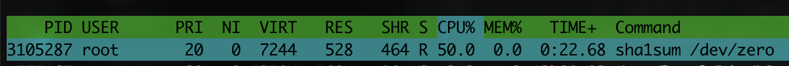

# limited-run

limited-run is a program which limit the resources usage of your commands.

## usage


```shell
sudo limited-run --cpus=0.5 --memory=512M -- sha1sum /dev/zero
```



## features

- [ ] cgroup v1
  - [x] limit cpu
  - [x] limit memory
- [ ] cgroup v2
  - [x] limit cpu
  - [x] limit memory
